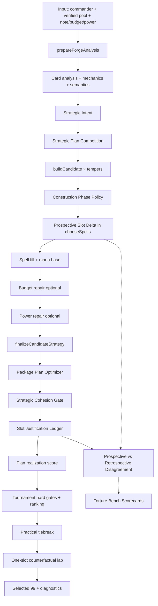

# MetaForge Reasoning Pipeline Architecture

> Captured: 2026-08-10  
> Scope: live construction intelligence in `web/app/`  
> Status: **authoritative boundary document** for the post–torture-bench engine  
> Next milestone name: **MetaForge Self-Evaluation** (not another planning layer)

This document describes what exists today — not aspirational theory.
It exists so future work mines **prediction error** instead of inventing abstractions blind.

---

## 1. The architectural pivot

Until the Commander torture bench, MetaForge evolved by:

```
observe bad deck → invent abstraction → implement → repeat
```

That produced a real construction engine. The disagreement audit changes the loop:

```
forge → prospective belief → finished-deck evaluation → disagreement / prediction error → fix the class of miss
```

**Do not add another abstract reasoning layer until Self-Evaluation has mined disagreement evidence across many forges.**

The north-star question remains:

> If we hand MetaForge a commander whose strategy was never considered while designing these systems, can it infer what a coherent deck actually requires?

---

## 2. Reasoning pipeline (layers)



Torture-bench / disagreement audit currently run **outside** production forge as instrumentation (`torture-bench-audit.mjs`). Self-Evaluation v1 promotes construction-trace analysis into a first-class forge artifact (`construction-trace.mjs` + `reasoning-drift.mjs` → `selected.selfEvaluation`).

---

## 3. Call graph: `forgeNativeMasterwork` → ranking

Entry: `web/app/native-masterwork-engine.mjs` → `forgeNativeMasterwork(input)`

| Step | Function / module | What happens |
|---|---|---|
| 1 | `prepareForgeAnalysis` | Pool analysis, blueprint parse, commander mechanics/scopes/tribes, `buildStrategicIntent` |
| 2 | `selectStrategicPlans` (`strategic-plan-competition.mjs`) | Evidence-gated plan candidates; top‑K diverse plans bound to ≤3 variants |
| 3 | `applyStrategicPlanToAnalysis` | Plan biases analysis for a temper |
| 4 | `buildCandidate` → `chooseSpells` | Live fill using `prospectiveSlotDelta` + `constructionPhase` weights |
| 5 | Mana base + role/curve assembly | Lands and deck size contract |
| 6 | `applyBudgetRepair` / `applyPowerRepair` | Claim-aware substitution; shared exclusion via `collectRepairExcludedNames` |
| 7 | `finalizeCandidateStrategy` | Cohesion attach → bomb repair → `optimizePackagePlan` → cohesion refresh → `attachSlotJustificationLedger` |
| 8 | `realizeStrategicPlanScore` | Predicted plan score vs realized structure |
| 9 | `runNativeMasterworkTournament` | Hard gates (size, roles, curve, blueprint, **cohesion**, commander support, land share) |
| 10 | `applyPracticalTiebreak` | Practical impact among nondominated candidates |
| 11 | `explainNativeMasterworkDecision` + one-slot labs | Post-selection explanation / counterfactuals |
| 12 | Report assembly | Selected deck + diagnostics |

Orchestration stays in `native-masterwork-engine.mjs`. Reasoning ownership lives in the modules below.

---

## 4. Module ownership (one page)

### `strategic-intent.mjs`
**Owns:** persistent construction contract — precise semantics, package catalog, replacement compatibility, expensive-threat support rules, cohesion validation.  
**Does not own:** live pick scoring, plan menus, tournament ranking, UI prose.  
**Invariant:** Aura ≠ enchantment; Equipment ≠ artifact; false friends never satisfy core density.

### `forge-interaction-graph.mjs`
**Owns:** producer/payoff signal extraction, pairwise synergy edges, nonbos, amplifiers.  
**Does not own:** package catalogs, construction policy, final legality.  
**Invariant:** subtype-precise production where required (Aura subtype; Instant/Sorcery → `spells`). Scoped commander rewards (e.g. Bear-only ETB) must survive scope checks in the engine.

### `strategic-plan-competition.mjs`
**Owns:** evidence-driven competing support plans above construction; diversity selection; predicted vs realized plan scoring hooks.  
**Does not own:** card-by-card fill; must not invent unsupported thematic plans from broad type overlap alone.  
**Invariant:** plans are evidence-gated; near-duplicates are collapsed.

### `construction-phase.mjs`
**Owns:** phase derivation (foundation → development → refinement → completion) and centralized weight policy.  
**Does not own:** deficit measurement (consumes live deficit state); card semantics.  
**Invariant:** raw quality weight rises only as mandatory floors are satisfied; phases derive from state, not pick ordinals.

### `prospective-slot-delta.mjs`
**Owns:** pick-time belief — “what does adding this card improve/preserve/duplicate/damage on the current partial deck?”  
**Does not own:** finished-deck truth; cohesion authority.  
**Invariant:** package floors and false friends are visible at selection time; retrospective ledger remains the audit.

### `package-plan-optimizer.mjs`
**Owns:** bounded whole-package counterfactual rebalance/contract after a draft 99 exists.  
**Does not own:** unbounded combinatorial deck search; commander-specific patches.  
**Invariant:** search stays within configured limits (deterministic, bounded).

### `slot-justification-ledger.mjs`
**Owns:** finished-deck per-slot footprint, strength, flags (weak / raw-power / redundant / package-critical), removal consequence.  
**Does not own:** live pick policy; must not invent narrative excuses.  
**Invariant:** every final nonland has a ledger entry after finalize.

### `native-masterwork-tournament.mjs`
**Owns:** multi-candidate hard gates + nondominated structural ranking.  
**Does not own:** construction; practical impact (handled by engine tiebreak).  
**Invariant:** failed cohesion / missed supported blueprint / illegal size cannot advance.

### `torture-bench-audit.mjs` + `tests/commander-torture-bench/`
**Owns:** generalization diagnosis — structural scorecards, failure classes, prospective↔retrospective disagreement, aggregate bench stats.  
**Does not own:** production forge path (yet); commander-specific production logic.  
**Invariant:** failures are data; do not lower standards to force green.

### `native-masterwork-engine.mjs`
**Owns:** orchestration, analysis prep, `chooseSpells`, mana, repairs, finalize wiring, practical labs, report.  
**Does not own:** the semantic meanings of packages (intent), phase coefficients (construction-phase), or disagreement taxonomy (torture audit).  
**Invariant:** repairs honor shared exclusions and package-compatible replacement rules from intent.

---

## 5. Layer invariants (authoritative claims)

| Layer | Guarantees |
|---|---|
| Strategic Intent | Structural obligations are explicit and shared across select/repair/refill/validate |
| Plan Competition | Only evidence-backed plans compete; unsupported themes are not hallucinated |
| Construction Phase | Early picks prioritize deficits; late picks may prefer quality once floors hold |
| Prospective Delta | Selection believes it is closing live deficits (belief, not truth) |
| Package Optimizer | Post-build package health can improve without unbounded search |
| Cohesion Gate | **Authoritative for structural package validity** at hard-gate time |
| Slot Ledger | **Authoritative retrospective justification** for each nonland |
| Tournament | Illegal / incoherent candidates cannot be selected |
| Disagreement Audit | Classifies prediction error; does **not** auto-mutate the deck |

---

## 6. Data contracts between modules

### `StrategicIntent` (frozen object)
- `packages[]` — `{ id, coreSemantics, falseFriendSemantics, supportSemantics, packageSignals, coreMin, supportMin, requireBalancedLegs?, … }`
- `commanderMechanics` / `commanderScopes`
- `roleTargets`, curve/budget/power constraints
- `excludedNames`, `excludedRoles`

Flows: analysis → chooseSpells → repairs → optimizer → cohesion → ledger → tournament diagnostics.

### Analyzed card / selected row
Common fields threaded through construction:
- `roles`, `cmc`, `strategicSemantics` (Set)
- `mechanics: { produces, rewards, signals }`
- `commanderConnectionSignals`
- `directTribes` / `tribalSupport` (typal lens)
- `prospectiveDelta` *(written at pick time in chooseSpells)*
- ledger slot *(written at finalize)*

### Prospective delta → ledger disagreement
| Pick-time (`prospectiveDelta`) | Finished (`slotJustificationLedger`) | Disagreement class |
|---|---|---|
| High total + filled package deficit | `redundant` / oversupply | early value became redundant |
| High total | weakly justified / raw-power | strong pick finished weak |
| Low total | package-critical | weak pick became critical |
| Package-core fill | overSupported | deficit fill became oversupply |

### Plan prediction → realization
- `strategicPlanPrediction.predictedScore`
- `strategicPlanRealization.{ realizedScore, gap, underperformed }`
- Soft demotion in ranking when realized cohesion collapses

---

## 7. What the torture bench proved (architecture implications)

- Hard failures **5 → 0** after **general** fixes (signals, packages, tribe stopwords, connection floor) — not commander patches.
- Remaining dominant warning class: **`thin_interaction_graph`** → knowledge/wiring limit, not collapse.
- Highest-leverage bottleneck: **prospective belief vs retrospective evaluation** (prediction error).
- Pearl-Ear remains the regression lock; generalization is measured by the torture matrix, not Pearl-Ear alone.

Artifact paths:
- `web/tests/commander-torture-bench/baseline-results.json`
- `web/tests/commander-torture-bench/after-fixes-results.json`
- `web/tests/commander-torture-bench/latest-results.json`

---

## 8. Next milestone: MetaForge Self-Evaluation

**Not** another deckbuilding brain layer.

### Goal
Promote disagreement from “bench diagnostic” to **construction-trace dataset**.

### Likely subsystem names
- Construction Trace Analyzer
- Reasoning Drift Analyzer
- Reasoning Drift Report (per forge)

### Desired per-pick record (sketch)
```
Pick #27
Expected: closes package deficit, commander support, curve help
Reality:  redundant / weak / critical
Cause class: package saturation underestimated | graph miss | phase drift | …
Net usefulness: 0–100
```

### Success criteria
- Every forge can emit a machine-readable drift report
- Aggregations across many forges identify **subsystem** failure rates
- Fixes still target **classes**, proven by torture-bench transfer across archetypes
- Existing hardening stack + Pearl-Ear remain green
- **Do not** invent the next planning abstraction from intuition alone

### Explicit non-goals for Self-Evaluation v1
- No new strategic planning layer
- No commander-specific production branches
- No lowering torture-bench standards
- No premature ML training loop — first ship the evidence schema and aggregations

---

## 9. Discipline that must survive

When a deck fails:

1. Classify the **general** reasoning deficiency  
2. Fix that class  
3. Rerun torture bench + hardening stack  
4. Require transfer across multiple archetypes  

Never:

```js
if (commander === "Pearl-Ear") { … }
```

Commander-specific **fixture expectations** are fine.  
Commander-specific **production logic** is not.

---

## 10. File map (quick)

| Path | Role |
|---|---|
| `app/native-masterwork-engine.mjs` | Orchestrator |
| `app/strategic-intent.mjs` | Contract + semantics + cohesion |
| `app/forge-interaction-graph.mjs` | Mechanical graph |
| `app/strategic-plan-competition.mjs` | Plans above construction |
| `app/construction-phase.mjs` | Phase weights |
| `app/prospective-slot-delta.mjs` | Pick-time belief |
| `app/package-plan-optimizer.mjs` | Post-build package search |
| `app/slot-justification-ledger.mjs` | Retrospective truth |
| `app/native-masterwork-tournament.mjs` | Hard gates + structural rank |
| `app/torture-bench-audit.mjs` | Scorecards + disagreement |
| `app/construction-trace.mjs` | Self-Evaluation pick-time belief records |
| `app/reasoning-drift.mjs` | Drift compare, taxonomy, forge artifact, aggregation |
| `tests/commander-torture-bench/` | Generalization fixtures + results |
| `tests/self-evaluation.test.mjs` | Construction-trace / drift regressions |

Self-Evaluation v1 ships observational artifacts on every finalized forge (`selected.selfEvaluation`). It does **not** change construction weights. Aggregate dumps: `tests/commander-torture-bench/self-evaluation-aggregate.json`.

---

## 11. Architecture freeze + Validation Harness (current)

**Status: Brain v1 frozen. Next milestone: MetaForge Field Validation.**

After oversupply saturation awareness and final-weak-slot forensics/cleanup, MetaForge can:

- attribute defects to subsystems (e.g. live_fill 100% of weak finals)
- distinguish avoidable vs constraint-forced weak slots
- improve without collapsing beneficial emergence or reintroducing hard failures

**Do not invent Brain Sprint 2 yet.**

Frozen field benchmark: `tests/validation-harness/brain-v1-frozen-benchmark.json`  
(13 fixtures × 8 seeds = 104 forges; 100% pass; seed-stable per-forge rates)

Validation harness: `docs/VALIDATION_HARNESS.md`, `app/validation-harness.mjs`

```
run many commanders → record SE + forensics → aggregate → compare baseline (per-forge) → evidence report
```

Next: real Commander corpora in the **same report shape**. Nightly automation only after that data is representative.

Rule: **No new reasoning layer until repeated field evidence earns one.**

Philosophy: [`ENGINEERING_PRINCIPLES.md`](./ENGINEERING_PRINCIPLES.md)

---

*This document should be updated when a layer’s ownership or authoritative invariant changes — not when a fixture is added.*
